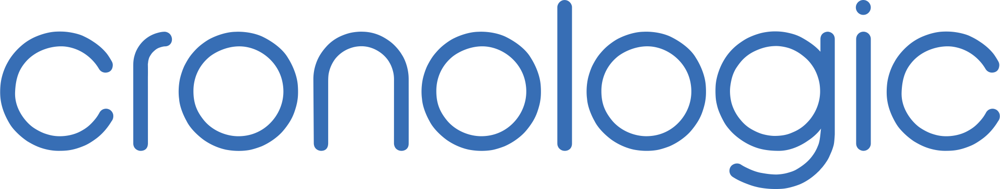

## Welcome to the public GitHub space of [cronologic](https://www.cronologic.de "Come visit us!")

[cronologic](https://www.cronologic.de "Yeah, visit us, don't be shy!") builds state-of-the-art [time-to-digital converters (TDCs)](https://en.wikipedia.org/wiki/Time-to-digital_converter "Visit Wikipedia!") and [high-speed analog-to-digital converters (ADCs)](https://en.wikipedia.org/wiki/Analog-to-digital_converter "Visit Wikipedia!"). We are based in beautiful Frankfurt/Germany and have our roots in an academic environment and in basic research/fundamental sciences. 

Feel free to browse through our repositories. We include our publicly available information and code examples here. This includes the Linux drivers for our measurement devices, the most recent versions of our user guides, and example code to help you get started using our products in your own applications. In some cases, we also share things that we consider interesting (and perhaps informative).
